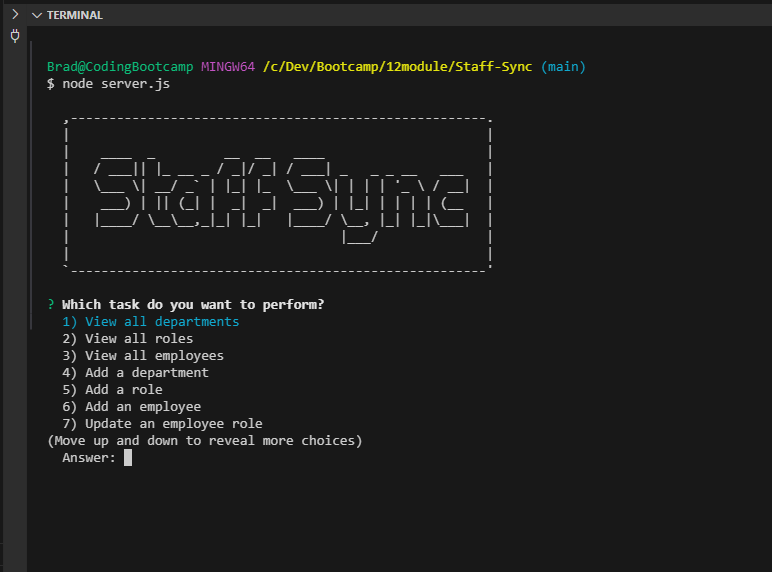

# Staff Sync
Staff Sync is a useful application to manage all of your Employees.
## Description
Staff Sync allows a user to add, edit and delete Employees of their company in a database.  This command-line application is very easy to use and very responsive.  Managing the Employees of your company has never been easier.
 

 
## Table of Contents
1. [Installation](#installation)
2. [Usage](#usage)
3. [License](#license)
4. [Contributing](#contributing)
5. [Tests](#tests)
6. [Questions](#questions)
7. [Acknowledgements](#acknowledgements)

## Installation
npm install

## Usage
This application is public and the code can easily be cloned to be used by anyone.

## License
This project is not currently licensed.

## Contributing
Please email me with any comments and suggestions about Staff Sync.

## Tests
npm run test

## Questions
If you have any questions about this Project or its Repository, I can be reached at <a href=mailto:brabur@yahoo.com>brabur@yahoo.com</a>.  You can also find more of my work at <a href="https://github.com/BradBurr-Github" target="_blank">BradBurr-Github</a>.

## Acknowledgements
None at this time.